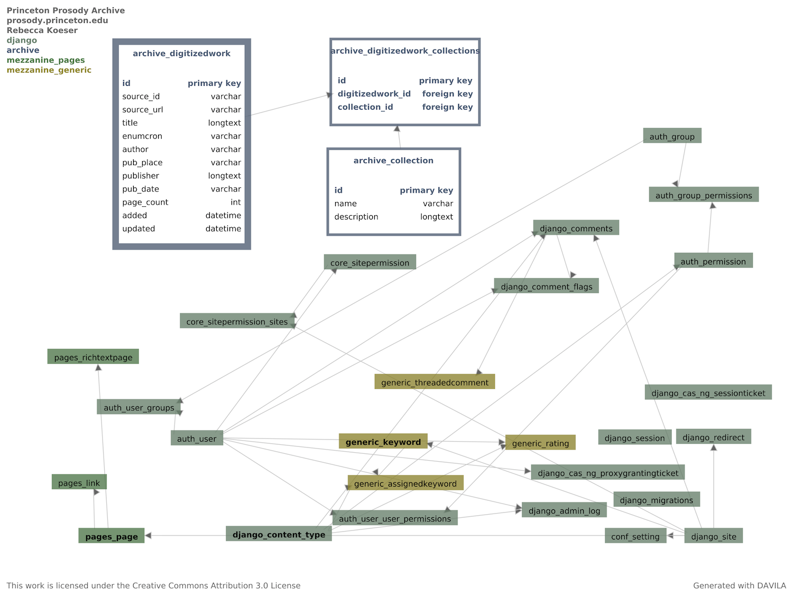
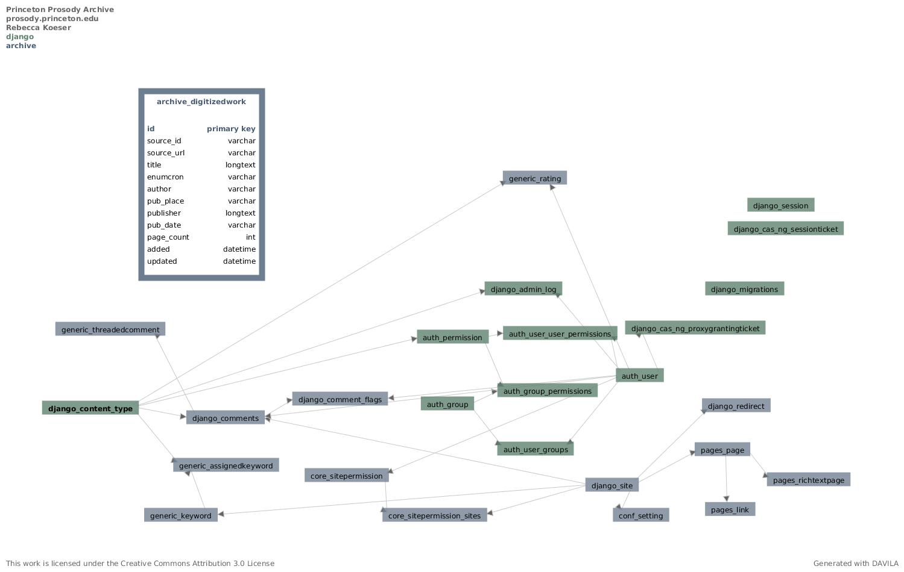

Architecture
============

.. toctree::
   :maxdepth: 2

The PPA Django application uses a SQL database as a thin layer to provide
administrative management and reporting at the level of Digitized Work,
and a Solr index for search and browse on Digitized Work metadata and
page content.

Database
--------

3.1 Updates
^^^^^^^^^^^

* Add optional  :attr:`~ppa.pages.models.Person.photo` on
  :class:`~ppa.pages.models.Person` to support
  displaying photos on the contributor page.
* Add new :attr:`~ppa.archive.models.DigitizedWork.protected_fields`
  to :class:`~ppa.archive.models.DigitizedWork` to enable preserving
  local edits to HathiTrust metadata.

Wagtail (Release 0.10)
^^^^^^^^^^^^^^^^^^^^^^
.. image:: _static/ppa-schema-v10.png
    :target: _static/ppa-schema-v10.png
    :alt: PPA Databse Schema, version 0.10

The primary purpose of this database revision is to remove Mezzanine and add
Wagtail as the CMS employed by the project. The pages module represents the
various page types (constituting separate Django apps) that are all subclasses
of Wagtail's base page model (expanded for detail with one example of the
subclassed types).

Collections (Release 0.6)
^^^^^^^^^^^^^^^^^^^^^^^^^

This database revision adds Collections to the schema, as well as
some generic functionality import from Mezzanine as the result of using its
rich text field for the description field of Collections.

Initial Schema (Release 0.5)
^^^^^^^^^^^^^^^^^^^^^^^^^^^^

As of version 0.5, PPA is basically a stock Django/Mezzanine
application with a single database table to track imported Digitized Works.

Solr
----

Content is indexed in Solr under two `item types`: "work", which contains
the bibliographic metadata for a digitized work, and "page", which contains
the text content for an individual page.  Work and corresponding pages are
both indexed with `source_id`, e.g. HathiTrust id for Hathi materials, to allow
grouping work and pages together in search results.
